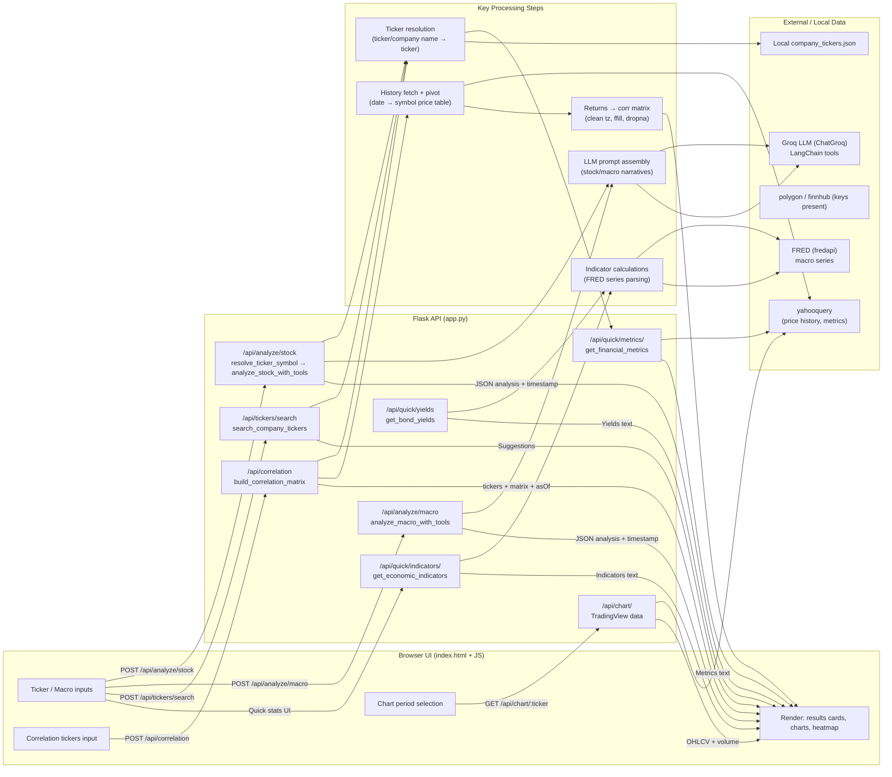

```mermaid
flowchart LR
    subgraph Client["Browser UI (index.html + JS)"]
        A1["Ticker / Macro inputs"]
        A2["Chart period selection"]
        A3["Correlation tickers input"]
        A4["Render: results cards, charts, heatmap"]
    end

    subgraph FlaskAPI["Flask API (app.py)"]
        B1["/api/analyze/stock\nresolve_ticker_symbol → analyze_stock_with_tools"]
        B2["/api/analyze/macro\nanalyze_macro_with_tools"]
        B3["/api/tickers/search\nsearch_company_tickers"]
        B4["/api/quick/metrics/<ticker>\nget_financial_metrics"]
        B5["/api/quick/indicators/<type>\nget_economic_indicators"]
        B6["/api/quick/yields\nget_bond_yields"]
        B7["/api/chart/<ticker>\nTradingView data"]
        B8["/api/correlation\nbuild_correlation_matrix"]
    end

    subgraph DataSources["External / Local Data"]
        C1["yahooquery\n(price history, metrics)"]
        C2["FRED (fredapi)\nmacro series"]
        C3["polygon / finnhub (keys present)"]
        C4["Groq LLM (ChatGroq)\nLangChain tools"]
        C5["Local company_tickers.json"]
    end

    subgraph Processing["Key Processing Steps"]
        P1["Ticker resolution\n(ticker/company name → ticker)"]
        P2["History fetch + pivot\n(date → symbol price table)"]
        P3["Returns → corr matrix\n(clean tz, ffill, dropna)"]
        P4["LLM prompt assembly\n(stock/macro narratives)"]
        P5["Indicator calculations\n(FRED series parsing)"]
    end

    %% Client to API
    A1 -->|POST /api/analyze/stock| B1
    A1 -->|POST /api/analyze/macro| B2
    A1 -->|POST /api/tickers/search| B3
    A2 -->|GET /api/chart/:ticker| B7
    A3 -->|POST /api/correlation| B8
    A1 -->|Quick stats UI| B5

    %% API internals to processing
    B1 --> P1 --> B4
    B4 --> C1
    B1 --> P4 --> C4

    B2 --> P4 --> C4
    B5 --> P5 --> C2
    B6 --> P5 --> C2

    B7 --> C1

    B3 --> P1 --> C5

    B8 --> P1
    B8 --> P2 --> C1
    P2 --> P3
    P3 --> A4

    %% Data back to client
    B1 -->|JSON analysis + timestamp| A4
    B2 -->|JSON analysis + timestamp| A4
    B3 -->|Suggestions| A4
    B4 -->|Metrics text| A4
    B5 -->|Indicators text| A4
    B6 -->|Yields text| A4
    B7 -->|OHLCV + volume| A4
    B8 -->|tickers + matrix + asOf| A4
```

